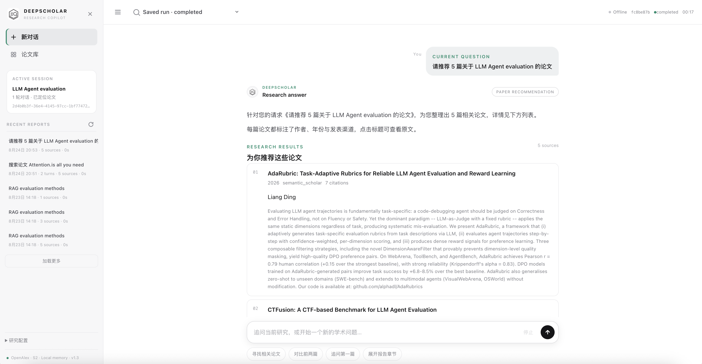

  
  <h1>DeepScholar</h1>
  
面向文献检索与深度调研的学术 Agent

  
<a href="README_EN.md">English</a> · 中文

  

    
    
    
    
  

  

## 项目简介

DeepScholar 是一个面向研究生与科研场景的学术 Agent，支持论文检索与推荐、论文对比与追问、引用查询，以及针对特定研究主题的深度调研报告生成。

> 项目适合本地研究工作流、教学和二次开发。不承诺学术事实绝对正确，也不包含认证、多租户或生产级 SLA。

## 核心能力

- **三类请求路径**：直接论文搜索/推荐/图谱查询，会话上下文追问，以及完整研究报告。
- **四类 Agent 职责**：Controller 负责意图路由，Planner 负责任务 DAG，Worker 隔离执行工具，Reviewer 执行质量验收和有界修复。
- **双执行模式**：Rule Mode 可在 Mock Provider 下完全离线运行；LLM Mode 可接入 DeepSeek 兼容接口并在失败时保留安全边界。
- **可追溯证据链**：PaperSource → EvidenceCard → CitationCheckResult → 报告章节，引用始终绑定稳定 source_id。
- **动态并行**：LangGraph StateGraph + Send API 对搜索、阅读和章节任务做有界 fan-out/fan-in。
- **多源检索**：Mock、项目内置 academic provider、OpenAlex、Semantic Scholar，以及可选的 Zotero + BGE-M3 + BM25 + Qdrant。
- **可观测运行**：后台 Run、渐进式 SSE 事件、取消、warning、retry/fallback 和完成态 SQLite 快照。
- **MCP 接入**：通过显式配置和工具白名单接入外部 MCP Server；默认关闭。

## 架构

~~~mermaid
flowchart LR
    U[用户问题] --> API[FastAPI]
    API --> C[Controller Agent 意图路由]
    C -->|direct_tool| D[单工具路径]
    C -->|conversation| CT[会话上下文路径]
    C -->|full_research| P[Planner Agent WorkPlan DAG]
    P --> S[Send fan-out]
    S --> W[Worker Agent × N 搜索 / 阅读 / 分析 / 写作]
    W --> M[确定性合并与去重]
    M --> E[Evidence Card]
    E --> Q[Citation Check + Evaluator]
    Q --> R[Reviewer Agent]
    R --> OUT[报告与状态]
    API --> SSE[SSE Event Broker]
    OUT --> STORE[RunStore + SQLite 快照]
~~~

### 一次完整研究

1. Controller 根据请求和 Session 选择 direct_tool、conversation 或 full_research。
2. Planner 生成带依赖关系的 WorkPlan。
3. Worker 在角色工具白名单内执行搜索、阅读和分析；互相独立的 WorkItem 通过 Send 并行。
4. Reducer 去重来源并生成稳定的 PaperSource。
5. Evidence Extractor 只从可追踪文本创建 Evidence Card。
6. Citation Check 验证引用编号、source_id、URL 和原文片段的一致性。
7. Reviewer 根据确定性质量指标决定通过、一次修复、一次重规划或失败。
8. API 通过 SSE 推送进度，并把完成态保存为可查询的运行快照。

## Rule Mode 与 LLM Mode

| 模式 | 适用场景 | 依赖 |
| --- | --- | --- |
| Rule | 离线测试、确定性回归、无 API Key 演示 | SEARCH_PROVIDER=mock 时无需网络 |
| LLM | 复杂意图、动态规划、受控工具循环和自然语言写作 | DEEPSEEK_API_KEY 或兼容接口 |

backend=graph_send 是默认的 LangGraph 并行路径；backend=loop 保留为兼容和对照用途。无论哪种模式，工具权限、调用预算、来源去重和引用检查都由程序控制。

## 快速开始

### 本地运行

建议使用 Python 3.12 或更新版本：

~~~bash
git clone <your-repository-url>
cd academic_research_copilot
python3 -m venv .venv
source .venv/bin/activate
python -m pip install -r requirements.txt
cp .env.example .env
uvicorn app.main:app --reload --host 127.0.0.1 --port 8000
~~~

.env.example 默认使用 Rule Mode + Mock Provider；它不包含任何真实密钥。启动后访问：

- Dashboard：<http://127.0.0.1:8000/>
- Swagger UI：<http://127.0.0.1:8000/docs>
- 健康检查：<http://127.0.0.1:8000/health>

### 发起研究请求

~~~bash
curl -X POST "http://127.0.0.1:8000/api/research/runs?backend=graph_send" \
  -H "Content-Type: application/json" \
  -d '{"topic":"large language model agent evaluation","language":"en","max_sources":5,"mode":"quick","agent_mode":"rule"}'
~~~

接口返回 HTTP 202 和 run_id。将返回的 ID 替换到下面的查询中：

~~~bash
curl -N "http://127.0.0.1:8000/api/research/stream/<run_id>"
curl "http://127.0.0.1:8000/api/runs/<run_id>"
~~~

### Docker Compose

Docker Compose 会启动 FastAPI 和可选的 Qdrant：

~~~bash
cp .env.example .env
docker compose up --build
~~~

只有在启用本地 RAG 时才需要准备 Zotero 目录、模型缓存和 Qdrant collection。宿主机论文目录通过 ZOTERO_STORAGE_PATH 以只读方式挂载，数据库和模型不会写入 Git。

## API 速览

| 方法 | 路径 | 用途 |
| --- | --- | --- |
| GET | /health | 服务状态与版本 |
| GET | /api/mcp/tools | MCP 连接状态和公开工具名 |
| POST | /api/sessions | 创建多轮研究会话 |
| GET / DELETE | /api/sessions/{session_id} | 查询或删除会话 |
| POST | /api/research/runs?backend=graph_send | 创建异步研究任务 |
| POST | /api/research/runs/{run_id}/cancel | 取消运行中的任务 |
| GET | /api/research/stream/{run_id} | 订阅 SSE 事件流 |
| GET | /api/runs/{run_id} | 查询运行详情或历史快照 |
| GET | /api/runs | 分页查询运行历史 |
| GET | /api/library | 查询论文库 |
| GET | /api/papers/detail?query=... | 查询论文详情 |
| GET | /api/evidence-library | 查询历史证据卡 |
| GET | /api/reports | 查询已保存报告 |

完整请求和响应 schema 见 Swagger UI 或 app/api/schemas.py。

## 配置

所有密钥只从环境变量读取。复制 .env.example 后按需修改以下变量：

| 变量 | 说明 |
| --- | --- |
| AGENT_MODE | rule 或 llm |
| SEARCH_PROVIDER | mock、academic 或 openalex |
| DEEPSEEK_API_KEY | LLM 模式的可选密钥，保持在本地 |
| DEEPSEEK_BASE_URL / DEEPSEEK_MODEL | 兼容接口地址和模型名 |
| OPENALEX_API_KEY | OpenAlex 可选密钥 |
| SEMANTIC_SCHOLAR_API_KEY | Semantic Scholar 可选密钥 |
| ZOTERO_STORAGE_PATH | 本地 Zotero storage，只读 |
| LOCAL_RAG_ENABLED | 是否启用本地论文检索 |
| QDRANT_URL / QDRANT_API_KEY | Qdrant 地址和可选密钥 |
| SQLITE_DB_PATH | 完成态运行历史路径 |
| MCP_ENABLED / MCP_CONFIG_PATH | 是否启用 MCP 及配置文件 |

不要提交 .env、mcp_servers.json、数据库、模型权重、论文 PDF、.memory/、.task_outputs/、.transcripts/ 或评测原始 JSONL。

## 本地论文检索

本地 RAG 是可选能力，数据链路为 Zotero PDF → 文本质量检查 → 分页切块 → BGE-M3 向量 + BM25 → Qdrant → 受控检索工具。索引器不会修改 Zotero 目录；升级 schema 时应使用新的 collection 做 staging。

先执行只读发现：

~~~bash
ZOTERO_STORAGE_PATH=/path/to/zotero/storage \
python scripts/index_zotero_papers.py --discover-only
~~~

完整索引和迁移说明见 [本地论文数据](docs/本地论文数据.md)。

## 测试与 Benchmark

测试默认通过 tests/conftest.py 强制 Rule Mode、Mock Provider 和无网络配置：

~~~bash
python -m pytest tests -m "not openalex_live and not semantic_scholar_live" -q
~~~

可选的在线 smoke test 需要用户主动提供密钥并设置对应环境变量：

~~~bash
RUN_OPENALEX_LIVE=true python -m pytest -m openalex_live -v
RUN_SEMANTIC_SCHOLAR_LIVE=true python -m pytest -m semantic_scholar_live -v
~~~

Agent Harness 和离线调度 benchmark 不依赖真实 Provider：

~~~bash
PYTHONPATH=. python -m harness.run_suite
python benchmarks/serial_vs_send_benchmark.py --limit 3
~~~

运行产物写入被 Git 忽略的目录。Benchmark 的样本、延迟和外部网络行为不代表生产性能；请阅读 [benchmarks/README.md](benchmarks/README.md) 的边界说明。

## 项目结构

~~~text
app/
├── agents/          Controller、Planner、Worker、Reviewer 与会话 Agent
├── api/             FastAPI 路由和 Pydantic schema
├── graph/           LangGraph StateGraph、Send 和条件路由
├── llm/             LLM 客户端、协议和提示模板
├── mcp/             MCP 生命周期、适配和安全配置
├── retrieval/       Zotero、PDF、BM25、Embedding、Qdrant
├── services/        Session、Run、Memory、SSE 和工作区查询
├── storage/         完成态运行快照
└── web/             无框架静态 Dashboard
benchmarks/          可复现离线 benchmark 代码
docs/                架构、部署和本地数据说明
harness/             故障注入与确定性验收
scripts/             本地索引和 live smoke 命令
tests/               单元、契约和集成测试
~~~

## 安全与边界

- LLM 不负责分配 source_id、决定引用是否存在或绕过工具白名单。
- 引用检查验证内部一致性，不等于对学术结论做独立事实核验。
- MCP 默认关闭；启用后仍需要显式 server/tool allowlist。
- 本地论文、全文、记忆、数据库和模型缓存都属于用户数据，应放在仓库之外或由 .gitignore 排除。

## Roadmap

- 完善认证、租户隔离和外部任务队列，支持更长期的服务化部署。
- 增加可选的外部数据库和事件存储适配器。
- 扩展更多公开学术数据源与可插拔评测协议。
- 继续改进报告格式、人工确认节点和本地索引工具。

Roadmap 是方向性计划，不代表已承诺的发布日期或功能。

## 参与贡献

请先阅读 [CONTRIBUTING.md](CONTRIBUTING.md)、[CODE_OF_CONDUCT.md](CODE_OF_CONDUCT.md)、[SECURITY.md](SECURITY.md) 和 [CHANGELOG.md](CHANGELOG.md)。提交代码前运行离线测试，并确保没有将密钥、论文全文、数据库或运行产物加入提交。

## 许可证

本项目使用 [Apache License 2.0](LICENSE)。第三方数据源、模型和 API 仍受各自服务条款与许可证约束。
