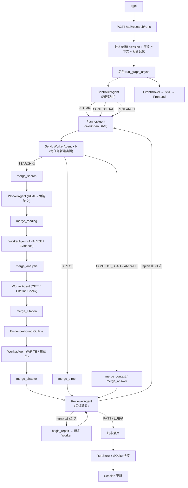

# Academic Research Copilot 当前架构

> 本文只描述当前代码。默认产品路径是 `backend=graph_send + agent_mode=llm`，采用 **四 Agent（Multi-Agent）架构**：ControllerAgent → PlannerAgent → WorkerAgent → ReviewerAgent 四个 Agent 分工协作。`graph` 是顺序 LangGraph 路径，`loop` 是保留的旧 Orchestrator 路径。

## 1. 系统边界

Academic Research Copilot 接收论文检索、推荐、引用图谱、深度调研与会话追问。它不训练模型，也不把"搜索结果直接塞给 LLM"当作完整报告链路。系统把请求路由到三条执行路线：

- `direct_tool`：单个有界工具能力，适合搜索、推荐和图谱查询（ATOMIC）。
- `conversation`：读取已有 Session、历史论文、证据和报告回答追问（CONTEXTUAL）。
- `full_research`：规划、并行检索、阅读归一化、证据抽取、引用校验、按章写作、规则评估与最终修复（RESEARCH）。

## 2. 四 Agent 架构

当前 Runtime 由四个独立可实例化的 Agent 类（`app/agents/*.py`）分工协作，通过类型化协议传递任务与结果：

| Agent | 角色 | 工具权限 | 输入 | 输出 | 职责 |
|---|---|---|---|---|---|
| **ControllerAgent** | `controller` | 无 | 用户请求 + Session | `ExecutionSpec` | 意图路由 → ATOMIC / CONTEXTUAL / RESEARCH |
| **PlannerAgent** | `planner` | 无 | `ExecutionSpec`（+ replan 时的 `ReviewVerdict`） | `WorkPlan`（WorkItem DAG） | 任务拆解、混合规划、有界重规划 |
| **WorkerAgent** | `worker` | Profile 白名单（fail-closed） | `WorkItem`（自包含任务信封） | `WorkerResult` | 单任务隔离执行；Send 扇出 N 个独立实例 |
| **ReviewerAgent** | `reviewer` | 无（只读） | `WorkPlan` + 全部 `WorkerResult` | `ReviewVerdict` | 验收 → PASS / REPAIR / REPLAN / CLARIFY / FAIL |

四个 Agent 各自独立可实例化、角色和工具权限互不相同，通过 `AgentProtocol` 交换 `AgentTask` / `AgentResult` 信封。完整协议链：

```
ExecutionSpec → WorkPlan → WorkItem → WorkerResult → ReviewVerdict
  (Controller)   (Planner)  (Worker)   (Worker)      (Reviewer)
```

关键设计：

- **Worker 扇出隔离**：`Send` 为每个 WorkItem 新建一个 `WorkerAgent` 实例，messages / 调用预算 / 去重集合互不共享，天然形成上下文隔离与并行边界。
- **Profile → 执行策略**：`WorkerAgent.strategy_for` 按 Profile 分派——`DETERMINISTIC`（DIRECT/READ/METADATA/CITE，固定工具顺序不进 LLM 循环）、`REACT`（SEARCH/ANALYZE，观察结果后继续决策的受控工具循环）、`SYNTHESIS`（ANSWER/WRITE/CONTEXT_LOAD，直接综合产出文本）。
- **有界反馈**：REPAIR ≤ 1 次、REPLAN ≤ 1 次，由 WorkPlan 的 `repair_count` / `replan_count` 约束；Reviewer 只能收紧结论，不能放宽。
- **`AgentRole`** 仅使用前四值；`SEARCH/READING/CITATION` 是协议 1.0 兼容值，避免历史运行记录失效。

## 3. 默认请求链路



REVIEWER 之后通过 `route_after_four_agent_reviewer` 条件路由：REPAIR 且 `repair_count < 1` → `begin_repair`（重跑受影响 Worker）；REPLAN 且 `replan_count < 1` → 回到 PlannerAgent；否则终态落库。

## 4. 运行时分层

| 层 | 当前实现 | 责任 |
|---|---|---|
| API | `app/api/routes.py`, `schemas.py` | DTO、Session 准备、后台任务、取消、SSE、历史查询 |
| Controller Agent | `app/agents/controller.py` | ControllerAgent：规则优先处理会话续接；普通请求可用 LLM 分类，失败回退规则；产出 ExecutionSpec |
| Graph Runtime | `app/graph/runtime.py` | StateGraph、条件路由、Send fan-out/fan-in、重试、状态落库 |
| Planner Agent | `app/agents/planner.py`, `llm_planner.py` | PlannerAgent：LLM 候选 + 规则硬校验的混合规划；失败回退规则 TaskDAG；有界重规划 |
| Worker Agent | `app/agents/worker.py`, `llm_worker.py` | WorkerAgent：单任务隔离执行，按 Profile 分派 DETERMINISTIC/REACT/SYNTHESIS |
| Reviewer Agent | `app/agents/reviewer.py`, Evaluator | ReviewerAgent：hard gate → Evaluator → 可选语义 LLM（只能收紧） |
| Agent 协议 | `app/agents/schemas.py`, `protocol.py` | AgentRole、WorkItem/WorkPlan/WorkerResult/ReviewVerdict、角色工具白名单 |
| Trust | `evidence_extract_tool.py`, `citation_check_tool.py` | 证据卡、引用规则、证据覆盖与成稿修复 |
| Tools | `tools/base.py`, `tools/registry.py` | BaseTool、ToolResult、Schema、白名单、动态工具注册 |
| MCP | `mcp/manager.py`, `client.py`, `tool_adapter.py` | 启动发现、命名空间、跨进程调用、BaseTool 适配 |
| Memory | `session_store.py`, `context_compressor.py`, `user_memory.py` | 会话状态、四级压缩、文件型跨会话记忆 |
| Reliability | `harness/`, `observability/` | 故障注入、指标断言、Hook、Trace、脱敏 |
| Persistence | `run_store.py`, `sqlite_run_repository.py` | 热状态内存保存，终态运行快照写 SQLite |

## 5. State 与并行边界

`ResearchAgentState` 是一次 Run 的共享状态。普通字段由负责节点单写；并行子节点只能向 `_search_bucket`、`_reading_bucket`、`_chapter_bucket` 追加。三个 bucket 使用 `operator.add` reducer，之后由 merge 节点去重、排序、截断并写入正式字段。`evidence_cards` 使用稳定键合并 reducer，支持一次引用失败后的证据重抽取。

Send payload 显式携带子任务需要的字段。Reading 子任务拿到 `target_source`，章节子任务只拿到本章分配的 `chapter_sources` 和 `chapter_cards`。这既避免并发覆盖，也构成上下文隔离。

## 6. LLM 与规则的边界

LLM 适合语义判断和生成：ControllerAgent 的意图分类、PlannerAgent 的复杂计划、WorkerAgent 的检索动作选择与会话回答、Outline 与章节写作、ReviewerAgent 的可选语义审查。规则代码负责可判定约束：工具白名单、JSON Schema、调用预算、去重、超时、来源去重、Citation Check、Evaluator、最大一次重试、最终完成门。

项目不是纯 ReAct。只有 WorkerAgent 的 **REACT 策略**（SEARCH/ANALYZE）内部是"观察工具结果后继续决策"的受控工具循环；全局拓扑仍是显式 LangGraph Workflow。整体更准确地称为 **以显式图工作流为控制面、四 Agent 分工协作的有界自治 Multi-Agent 系统**。

## 7. 数据与持久化

- `SessionStore`：进程内、带 TTL 的活跃会话；保存推荐论文、当前论文/报告、最近消息、完整 transcript 与压缩摘要。
- `RunStore`：进程内运行态，服务 SSE 和查询。
- `SQLiteRunRepository`：运行完成时保存不可变快照，默认 `data/research_history.db`；支持按 session 恢复历史。
- `.task_outputs/` 与 `.transcripts/`：大 Tool Result 和压缩前 transcript 的文件持久化。
- `.memory/`：跨会话文件型用户记忆。
- Redis：当前代码没有实际使用。

## 8. 可信性边界

系统可以降低幻觉风险，但不能保证事实绝对正确：Provider 仍可能返回错误 metadata；摘要或全文可能不完整；规则 Citation Check 只能验证 ID、URL 和文本片段的内部一致性，不能独立证明学术结论为真；LLM 合成仍可能误读证据。因此报告保留 warning、partial 状态、evidence gap 和 unresolved issues。

## 9. 当前明确局限

- 没有分布式队列或跨进程 Session；应用重启依赖 SQLite run 快照恢复，而不是恢复原 Session ID 的完整运行态。
- **Multi-Agent 是同进程内的四 Agent 协作**：Controller/Planner/Worker/Reviewer 独立可实例化、通过类型化协议协作、Worker 按 Send 扇出隔离实例——但**不是分布式自治 Agent 服务**：无跨进程通信、无独立记忆、无 A2A，全局控制流仍是显式 LangGraph Workflow，自治是有界的（Profile 约束 + repair/replan 各一次 + Reviewer 只读收紧）。
- Citation Checker 是确定性工具/Profile（CITE），不是 LLM Agent。
- Reviewer 的评估重试只允许一次，且只重抽证据与重写后半链路。
- 全局不是 Reflection；Evaluator → retry 只是有限质量反馈回路。
- 本地 RAG 依赖外部 Qdrant 与预构建索引，并非默认必需路径。
